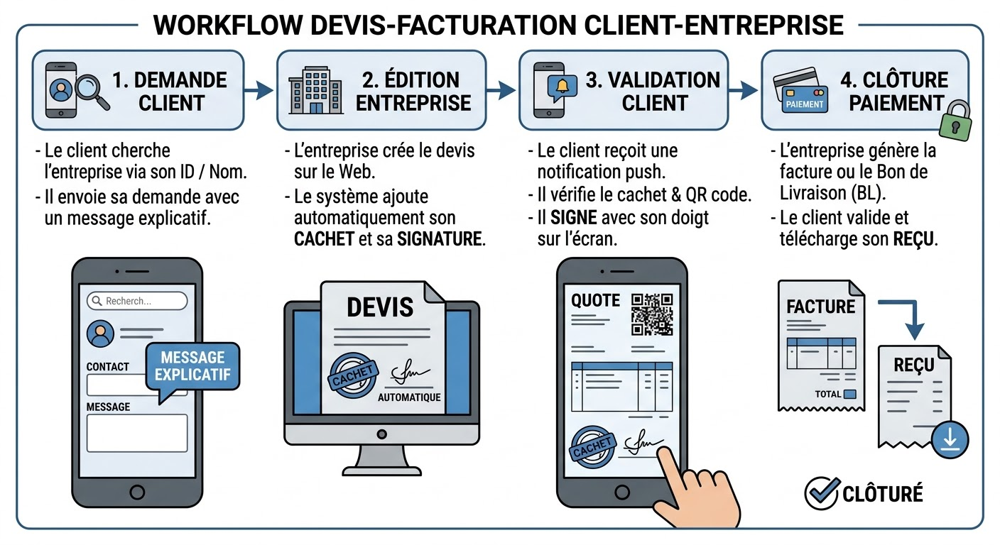

# 📄 E-Doc - Plateforme de Gestion Électronique de Documents (GED)

> **Projet Freelance Libre** (Open-Source) conçu et développé par **Abderrahim Bajji** & **Hasnae Amchich**.

**E-Doc** est une solution moderne et intelligente de dématérialisation et d'échange de documents commerciaux (Devis, Factures, Contrats, Bons de Commande, Bons de Livraison, Reçus, Bulletins de paie). Elle connecte directement les entreprises et leurs clients via un écosystème multiplateforme fluide, légal et sécurisé.

---

## 🚀 Fonctionnalités Principales

### 🏢 Pour l'Entreprise (Portail Web & App Compagnon)
* **Génération intelligente :** Création rapide de documents complexes via des templates dynamiques.
* **Authentification automatique :** Apposition automatique du cachet officiel de l'entreprise et de la signature du gérant.
* **Tableau de bord centralisé :** Suivi analytique des demandes clients, de l'état des documents (Brouillon, Envoyé, Signé, Payé) et du chiffre d'affaires.

### 📱 Pour le Client (Application Mobile)
* **Moteur de recherche :** Trouver facilement une entreprise partenaire via son nom ou son ID unique.
* **Coffre-fort numérique :** Centralisation et stockage sécurisé de tous les documents officiels reçus.
* **Validation instantanée :** Signature électronique tactile directement sur l'écran du smartphone.

---

## 🔄 Workflow & Parcours Utilisateur

Le processus a été pensé pour être transparent, rapide et sans friction, allant de la simple demande d'un client jusqu'à la clôture par paiement.

### 1. Interactions Globales (Client ⇄ Entreprise & B2B)
*(Modes de communication C2B, B2C et B2B)*

### 2. Le Cycle de Vie d'un Document (Exemple : Devis à Facture)
*(Les 4 étapes clés : Demande > Édition > Validation > Clôture)*

.jpeg)

---

## 🛠️ Architecture Technique & Stack

Le projet repose sur une architecture multiplateforme unifiée, permettant d'offrir une expérience de bureau aux entreprises (Web) et une expérience mobile native aux clients, tout en communiquant avec une API centrale.

.jpeg)

* **Frontend (Mobile & Web) :** Flutter / Dart - Pour une interface rapide, réactive et unifiée sur iOS, Android et Navigateur PC.
* **Backend (API REST) :** Node.js avec Express - Cerveau du système gérant la logique métier, l'authentification (JWT), la conversion HTML vers PDF et l'incrustation des cachets.
* **Base de Données :** MongoDB - Base de données NoSQL flexible pour gérer les différents profils, le catalogue de services et les métadonnées de requêtes.
* **Stockage Fichiers :** Cloud Storage (ex: AWS S3) - Hébergement sécurisé des PDF finaux, des QR codes générés, et des images de signatures.

---

## 👥 Auteurs & Contributeurs

Projet réalisé en duo :
* 👨‍💻 **Abderrahim Bajji**
* 👩‍💻 **Hasnae Amchich**

*Projet libre de droits créé dans le cadre d'une initiative freelance visant à faciliter la numérisation des entreprises B2B et B2C.*
